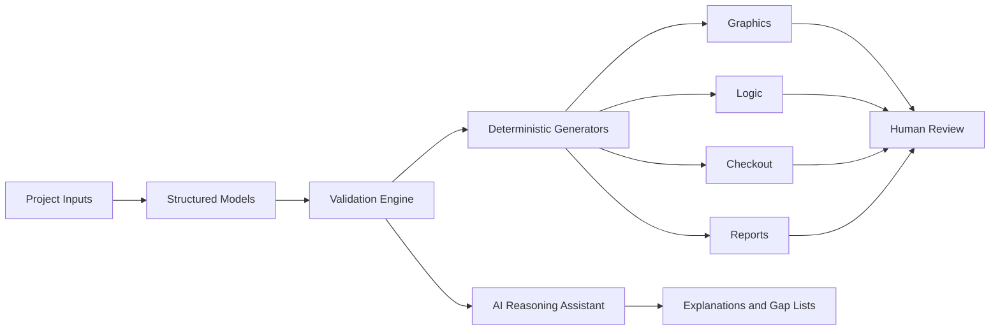

# Architecture

## Purpose
Describe the intended system architecture for the BAS programming assistant.

## Scope
This document defines high-level components, data flow, boundaries, and integration strategy. It does not prescribe every class or function.

## Inputs
- Structured project data.
- Equipment schedules.
- Controller inventories.
- Point lists.
- Sequences of operation.
- User-approved configuration.

## Outputs
- Graphics definitions.
- Control logic artifacts.
- Checkout sheets.
- Reports.
- Validation results.
- Human-readable explanations.

## Dependencies
- [Project Model](models/project.md)
- [Equipment Model](models/equipment.md)
- [Points Model](models/points.md)
- [Validation](reasoning/validation.md)

## Design Reasoning
The architecture separates data ingestion, validation, generation, and review. This keeps generated outputs reproducible and makes it possible to test each module independently.

## Architectural Modules
- Importers normalize source files into structured models.
- Validators check completeness, consistency, naming, and engineering constraints.
- Generators produce outputs from validated data.
- AI assistants explain reasoning, flag ambiguity, and draft documentation.
- Review tools present outputs for human approval.

## Future Improvements
- Define package layout after technology selection.
- Add plugin boundaries for Niagara, BACnet, and vendor-specific exporters.
- Add persistence strategy and schema migration policy.

## Examples
- A CSV point list is imported into the points model, validated against naming rules, then used to generate checkout steps.
- A sequence of operation is parsed into structured requirements before any control logic is generated.

